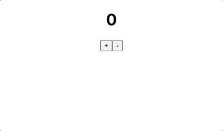
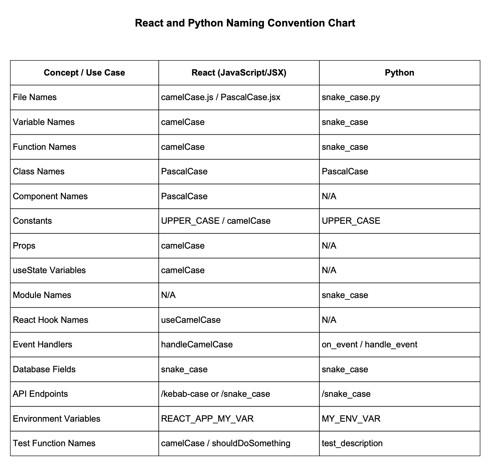

<a name="readme-top"></a>


<div align="center">
<!-- Title: -->
<h1><a href="https://github.com/skthati/react.git">React</a> - Basics </h1>
</div>

<!-- Table of contents -->
<hr>
<hr>
<ol>
    <li><a href="#react-basics">React Basics</a></li>
    <li><a href="#counter">Counter</a><li>

</ol>
<hr>
<hr>

# React Basics <a name="react-basics"></a>
 All basic code syntax 

```React
//React
console.log("Hello World!")
```
<p align="right">(<a href="#readme-top">back to top</a>)</p>
<hr>  

# Install React
- Create a folder and go into the folder. Use terminal and write below code.
    ```
    npx create-react-app name-label
    cd name-label
    npm start
    ```
- Your website is running on `http://localhost:3000`

## Create a component with simple H1 tag
- Create a folder `components` under `src`
- Create a new js file `my_name.js` and write below code
    ```React
    function MyName():
    return (
        <h1>Hello World!<h1>
    )

    export default MyName
    ```
- In `App.js` delete all template content and write below code
    ```React
    import MyName from './components/myName.js'

    function App(){
        return (
            <MyName />
        )
    }

    default export App
    ```

# Click Count
- Functions should have PascalCase.
- Create a new js file `clickCount.js` in components folder

    ```React
    import React from 'react`;
    import { useState } from 'react';

    function ClickCount() {
        const [countValue, setCountValue] = useState(0)

        function increaseCount(){
            return setCountValue(countValue+1)
        }

        return (
            <div>
                <h1>{ countValue } </h1>
                <button onClick={increaseCount}>+</button>
            </div>
        )
    }

    export default ClickCount
    ```

- In `App.js` register component `ClickCount`
    ```React
    import ClickCount from './components/clickCount.js'

    function App(){
        return (
            <div>
                <ClickCount />
            </div>
        )
    }
    ```

# Counter <a name="counter"></a>

"+" button to increase the counter
"-" button to decrease the counter



```React
import React, { useState } from 'react'

function MyCounter() {
    const [countValue, setCountValue] = useState(0)

    function increaseCount() {
        return setCountValue(countValue+1)
    }
    
    function decreaseCount() {
        return setCountValue(countValue-1)
    }

    return ( 
        <div>
            
            <h1>{ countValue }</h1>
            <button onClick={ increaseCount }>+</button>
            <button onClick={ decreaseCount }>-</button>
        </div>
    )
}

export default MyCounter
```

# NZ Public Holidays
- Get holidays list of NZ for the year 2025
- Create a new js file `NZHolidaysList.js` in components folder
    ```React
    import React from 'react'
    import { useState } from 'react'
    import { useEffect } from 'react'
    import axios from 'axios //install axios npm install axios in terminal.

    function NZHolidayList(){
        const [holidays, setHolidays] = useState([])

        useEffect(() => {
            axios.get('https://date.nager.at/api/v3/publicholidays/2025/NZ')
            .then(response => setHolidays(response.data))
            .catch(err => console.error('Unable to fetch holidays', err));
        }, []);

        return (
            <div>
                <h1>NZ Holidays </h1>
                {holidays.map(holiday =>(
                    <li key="holiday.date">
                        {holiday.date} - {holiday.name}
                    </li>
                ))}
            </div>
        )
    }

    export default NZHolidaysList
    ```

- 
    ```React
    useEffect(() => {
        axios.get()
        .then(res => res.data)
        .catch(err => console.log("error"))
    }, [])
    ```

## Bootstrap

- Install Bootstrap

    `npm install bootstarp`

- Add imports to `index.js` in src folder

    `import 'bootstrap/dist/css/bootstrap.min.css';`

## Navigation.

- add imports to `App.js`

    `import { BrowserRouter as Router, Routes, Route, Link } from 'react-router-dom'`

- Below code to `App.js`

    ```React
        <div className='App'>
        <Router>
            <nav>
            <Link className="nav-link" to="/">Home</Link>
            <Link to="/click-count">Click Count</Link>
            <Link to="/nz-holiday-list">NZ Holidays List</Link>
            <Link to="/fruit-list">Fruits List</Link>
            <Link to="/country-list">Countries List</Link>
            </nav>

            <Routes>
            <Route path='/' element={<MyName />} />
            <Route path='/click-count' element= {<ClickCount />} />
            <Route path='/nz-holiday-list' element= {<NZHolidaysList />} />
            <Route path='/fruit-list' element= {<FruitsList />} />
            <Route path='/country-list' element= {<CountriesList />} />
            </Routes>
        </Router>
        </div>
    ```

- navBar as a separate component and can be added to `App.js` as `<NavBar />`. Check `navBar.js` file in `components` folder.


# Naming Convention




<p align="right">(<a href="#readme-top">back to top</a>)</p>
<hr>  

# Click Count
```React
import React, { useState } from "react";

function ClickCount(){
    const [countValue, setCountValue] = useState(0)

    function increaseCount(){
        return setCountValue(countValue+1)
    }

    return (
        <div>
            <h1>{countValue}</h1>
            <button onClick={ increaseCount }>+</button>
        </div>
    )
}

export default ClickCount
```

# Props

```React
const person = {
    myname: John,
    myage: 55
}

const {myage: age, myname: name} = person


```
Show element only if it has data.
- `{ifVariable && "This only displays if ifVariable has data"}` 

```React
const countries = ["England", "Sri Lanka", "Australia"]

const para = countries.map((e) => `<p>{e}</p>`)


```

#### Capitalize a word
```React
const countries = ["england", "sri Lanka", "australia"]
const caps = countries.map((e) = e[0].toUpperCase() + e.slice(1))
```

- Read from json
```React
export default function App() {
    const countriesElement = countries.map((c) => {
        return <countries key={c.id} country={c.country} population={c.population}>
        <!-- Also you can use index as key... countries.map((c, index) => ) -->
    })

    return (
        <>
            <Header />
            <main className="container">
                {countriesElements}
            </main>
        </>
    )
}

Other way of calling Props
    const countryElements = data.map((entry) => {
        return (
            <Entry
                key={entry.id}
                entry={entry}   entry have all the props and have to be in same order
            />
        )
    })
```


## useState
```React
const [count, setCount] = useState()

function CountIncrease() {
    setCount((prevCount) => {
        return prevCount + 1
})
}
))
```

## Capture Form data
```React
function App() {
  
  function handleSubmit(event) {
    event.preventDefault()
    const formEl = event.currentTarget
    const formData = new FormData(formEl)
    const email = formData.get("email")
    console.log(email)
  }
  
  return (
    <section>
      <h1>Signup form</h1>
      <form onSubmit={handleSubmit} method="post">
        <label htmlFor="email">Email:</label>
        <input id="email" type="email" name="email" placeholder="joe@schmoe.com" />
        <br />
        
        <label htmlFor="password">Password:</label>
        <input id="password" type="password" name="password" />
        <br />
        
        <button>Submit</button>
        
      </form>
    </section>
  )
}
```

- If we use actions for the form onSubmit, data can be accessed directly
- Difference is `<form action={signUp}>` and `<form onSubmit={handleSubmit} method="post">`
```React
function App() {
  
  function signUp(formData) {
    const email = formData.get("email")
    console.log(email)
  }
  
  return (
    <section>
      <h1>Signup form</h1>
      <form action={signUp}>
        <label htmlFor="email">Email:</label>
        <input id="email" type="email" name="email" placeholder="joe@schmoe.com" />
        <br />
        
        <label htmlFor="password">Password:</label>
        <input id="password" type="password" name="password" />
        <br />
        
        <button>Submit</button>
        
      </form>
    </section>
  )
```
### Form controlled components
- onChange and value of every input field have to be monitored to get the updated values. Now with new Form actions, that is not necessary anymore.

### Textarea
```
<label htmlFor="description">Description:</label>
<textarea id="description" name="description"></textarea>
```

### Radio button
- name should be same in order for the radio button only one option selectable.
```React
       <fieldset>
          <legend>Employment Status:</legend>
          <label>
            <input type="radio" name="employmentStatus" value="unemployed" />
            Unemployed
        </label>
          <label>
            <input type="radio" name="employmentStatus" value="part-time" />
            Part-time
        </label>
          <label>
            <input type="radio" name="employmentStatus" value="full-time" />
            Full-time
        </label>
    </fieldset>
```

### Checkbox

```React
        <fieldset>
          <legend>Dietary restrictions:</legend>
          <label>
            <input type="checkbox" name="dietaryRestrictions" value="kosher" />
            Kosher
        </label>
          <label>
            <input type="checkbox" name="dietaryRestrictions" value="vegan" />
            Vegan
        </label>
          <label>
            <input type="checkbox" name="dietaryRestrictions" defaultChecked={true} value="gluten-free" />
            Gluten-free
        </label>
    </fieldset>


    function signUp(formData) {
    const email = formData.get("email")
    const password = formData.get("password")
    const employmentStatus = formData.get("employmentStatus")
    const dietaryRestrictions = formData.get("dietaryRestrictions")
    console.log(employmentStatus)
  }


```
- formData getAll gets all values
`const dietaryRestrictions = formData.getAll("dietaryRestrictions")`

### Select Option
```React
        <label htmlFor="favColor">What is your favorite color?</label>
        <select id="favColor" name="favColor">
          <option value="" disabled>-- Choose a color --</option>
          <option value="Red">Red</option>
          <option value="Orange">Orange</option>
          <option value="Yellow">Yellow</option>
          <option value="Green">Green</option>
          <option value="Blue">Blue</option>
          <option value="Indigo">Indigo</option>
          <option value="Violet">Violet</option>
    </select>

```

### Capture all form data

```React
  function signUp(formData) {
    const data = Object.fromEntries(formData)
    const dietaryData = formData.getAll("dietaryRestrictions")
    console.log(dietaryData)
    const allData = {
      ...data,
      dietaryRestrictions: dietaryData
    }
    
  }
```

### Jokes example

```React

export default function Joke(props) {
    const [isShown, setIsShown] = React.useState(false)
    
    function toggleShown() {
        setIsShown(prevShown => !prevShown)
    }
    
    /**
     * Challenge:
     * Only display the punchline paragraph if `isShown` is true
     */
    
    return (
        <div>
            {props.setup && <h3>{props.setup}</h3>}
            {isShown && <p>{props.punchline}</p>}
            <button onClick={toggleShown}>Show punchline</button>
            <hr />
        </div>
    )
}
```


## Ternary Operator
condition ? exprIfTrue : exprIfFalse

```React
<button onClick={someFunction}>{agree ? "Yes" : "No"}</button>

   function changeMind() {
        setIsGoingOut(prev => !prev)
    }

    function addFavoriteThing() {
        setMyFavoriteThings(
            prevFavThings => [
                ...prevFavThings,
                allFavoriteThings[prevFavThings.length]
            ]
        )
    }
    spread operator
    setIngredients(prevIngredients => [...prevIngredients, newIngredient])
```

## Modify State
```React
    const [contact, setContact] = React.useState({
        firstName: "John",
        lastName: "Doe",
        phone: "+1 (212) 555-1212",
        email: "itsmyrealname@example.com",
        isFavorite: false
    })
    
    let starIcon = contact.isFavorite ? starFilled : starEmpty

    function toggleFavorite() {
        setContact(prevContact => ({
            ...prevContact,
            isFavorite: !prevContact.isFavorite
        }))
    }

    Inline button toggle
    <button onClick={() => setIsShown(prevShown => !prevShown)}>
    Show punchline</button>

    Inline button label toggle
    <button onClick={() => setIsShown(prevShown => !prevShown)}>
    {isShown ? "Show punchline" : "Hide punchline"}</button>
```

### && operator

```React
if (false && console.log("This code is running")) {
    // console.log("Everything was true!")
}

if (true && true) {
    // console.log("Everything was true!")
}

Alternative would be using null and ternary operator
{isShown ? <p>{props.punchline}</p> : null}
```
### Ingredients List
```React
import React from "react"

export default function Main() {

    const [ingredients, setIngredients] = React.useState([])

    const ingredientsListItems = ingredients.map(ingredient => (
        <li key={ingredient}>{ingredient}</li>
    ))

    function addIngredient(formData) {
        const newIngredient = formData.get("ingredient")
        setIngredients(prevIngredients => [...prevIngredients, newIngredient])
    }

    return (
        <main>
            <form action={addIngredient} className="add-ingredient-form">
                <input
                    type="text"
                    placeholder="e.g. oregano"
                    aria-label="Add ingredient"
                    name="ingredient"
                />
                <button>Add ingredient</button>
            </form>
            <section>
                <h2>Ingredients on hand:</h2>
                <ul className="ingredients-list" aria-live="polite">{ingredientsListItems}</ul>
                <div className="get-recipe-container">
                    <div>
                        <h3>Ready for a recipe?</h3>
                        <p>Generate a recipe from your list of ingredients.</p>
                    </div>
                    <button>Get a recipe</button>
                </div>
            </section>
        </main>
    )
}
```

## Passing State as Props

```React
<!-- App.jsx -->
import React from "react"
import Count from "./Count"

export default function App() {
    const [count, setCount] = React.useState(0)

    function add() {
        setCount(prevCount => prevCount + 1)
    }

    function subtract() {
        setCount(prevCount => prevCount - 1)
    }

    return (
        <main className="container">
            <div className="counter">
                <button
                    className="minus"
                    onClick={subtract}
                    aria-label="Decrease count"
                >-</button>

                <Count number={count} />

                <button
                    className="plus"
                    onClick={add}
                    aria-label="Increase count"
                >+</button>
            </div>
        </main>
    )
}

<!-- Count.jsx -->

export default function Count(props) {
    return (
        <h2 className="count">{props.number}</h2>
    )
}

```
- passing state from child to parent
```React
        <button
            onClick={props.handleClick}
            aria-pressed={props.isFilled}
            aria-label={props.isFilled ? "Remove from favorites" : "Add to favorites"}
            className="favorite-button"
        >

        <!-- App.jsx -->

        <Star isFilled={contact.isFavorite} handleClick={toggleFavorite} />

```

- State can only be passed from parent to child. Not from child to child. So state has to be passed to parent in order to pass to another child.
```React
    <!-- App.js -->
    import React from "react"
    import Header from "./Header"
    import Body from "./Body"

    export default function App() {
        const [userName, setUserName] = React.useState("Joe")
        
        return (
            <main>
                <Header userName={userName} />
                <Body userName={userName} />
            </main>
        )
    }

    <!-- Header.js -->
    import avatar from "./icons/user.png"

    export default function Header(props) {
        return (
            <header>
                
                <p>{props.userName}</p>
            </header>
        )
    }

    <!-- Body.js -->

    export default function Body(props) {
        return (
            <section>
                <h1>Welcome back, {props.userName}!</h1>
            </section>
        )
    }


```


# Javascript

https://developer.mozilla.org/en-US/docs/Web/JavaScript/Reference/Global_Objects/Array/map

https://developer.mozilla.org/en-US/docs/Web/JavaScript

# React Course

https://www.codecademy.com/enrolled/courses/react-101

https://developer.mozilla.org/en-US/docs/Learn_web_development/Core/Frameworks_libraries/React_getting_started


<p align="right">(<a href="#readme-top">back to top</a>)</p>
<hr>  
